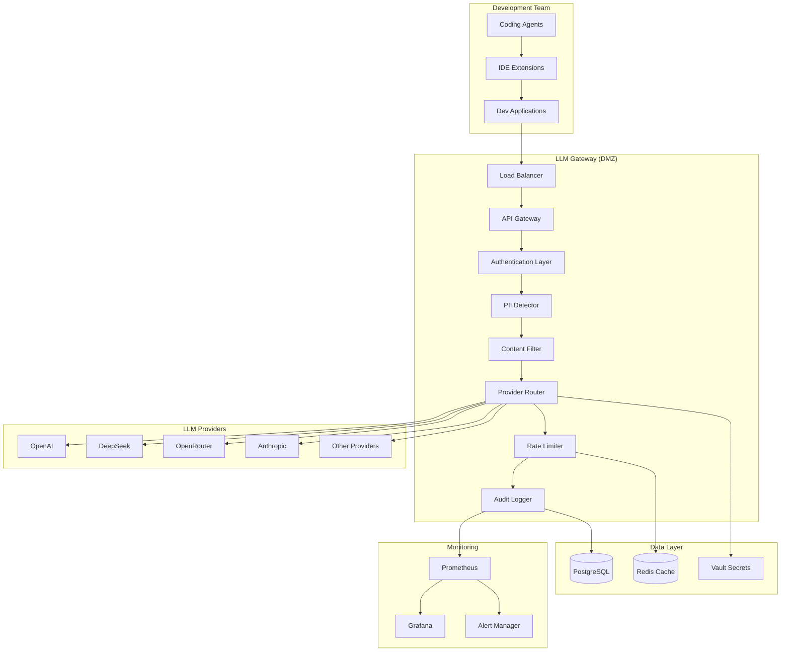
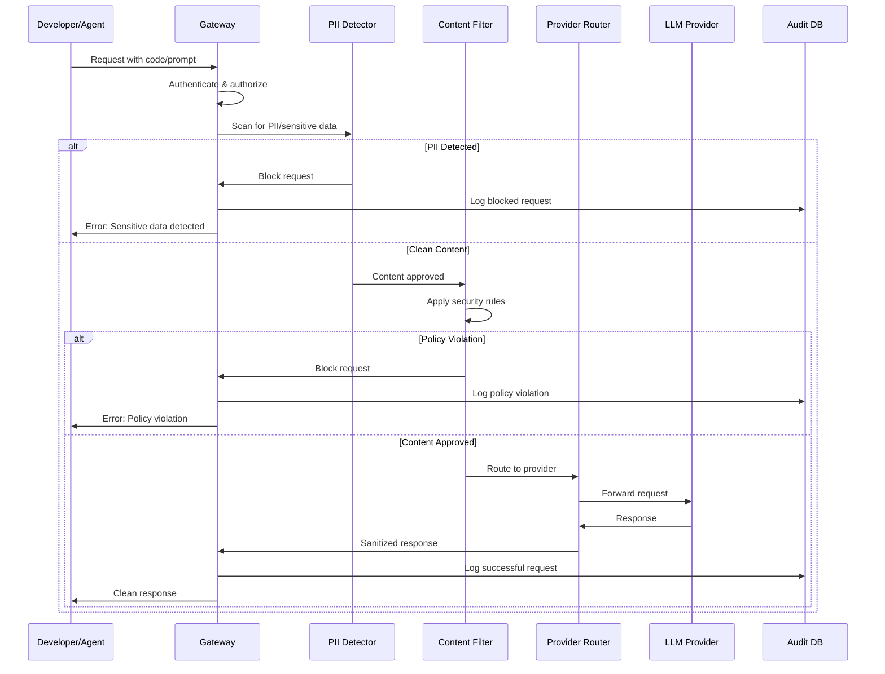

# LLM Gateway Architecture & Requirements

## Project Overview

**Goal**: Setup an LLM gateway for the development team that prevents direct access to LLM providers, ensuring privacy and security of the codebase through PII/sensitive data detection.

## Requirements

1. **Privacy & Security Focus**: Gateway should detect and block PII/sensitive information
2. **Multi-Provider Support**: Support for OpenAI, DeepSeek, OpenRouter, Anthropic, and other providers
3. **Developer Isolation**: Prevent direct LLM provider access from coding agents
4. **Audit & Compliance**: Complete logging and monitoring of all requests

## Tech Stack Recommendation

### Backend Framework
- **Node.js with Express.js** or **Python with FastAPI**
  - Fast development, excellent LLM provider SDK support
  - Strong ecosystem for security middleware

## Technology Comparison: Node.js vs Python

### Node.js (Express.js) - Pros ✅
- **Performance**: Excellent for I/O-heavy operations (API calls to LLM providers)
- **Real-time**: Built-in support for WebSockets and streaming responses
- **JavaScript Ecosystem**: Massive npm package ecosystem
- **Single Language**: Same language for frontend/backend if needed
- **Async by Default**: Natural fit for concurrent API calls to multiple providers
- **Memory Efficient**: Lower memory footprint for API gateway workloads
- **Fast Startup**: Quick cold starts, good for serverless deployments
- **JSON Native**: Excellent JSON processing performance
- **Developer Pool**: Large pool of JavaScript developers

### Node.js - Cons ❌
- **CPU-Intensive Tasks**: Not ideal for heavy ML/AI processing
- **Limited ML Libraries**: Fewer mature ML libraries compared to Python
- **Single-Threaded**: Can be blocked by CPU-intensive operations
- **Callback Complexity**: Can lead to complex async code (though modern async/await helps)
- **Package Quality**: npm ecosystem has some quality inconsistencies

### Python (FastAPI) - Pros ✅
- **ML/AI Ecosystem**: Excellent libraries for PII detection (Presidio, spaCy, transformers)
- **Data Processing**: Superior for text analysis and content filtering
- **Scientific Libraries**: NumPy, pandas for analytics and monitoring
- **Security Libraries**: Mature cryptography and security packages
- **Readability**: Clean, maintainable code
- **FastAPI Performance**: Comparable to Node.js for API workloads
- **Type Safety**: Excellent type hints and validation
- **Documentation**: Auto-generated API docs with FastAPI
- **Enterprise Adoption**: Widely used in enterprise environments

### Python - Cons ❌
- **Performance**: Slower than Node.js for pure I/O operations
- **Memory Usage**: Higher memory footprint
- **GIL Limitation**: Global Interpreter Lock can limit concurrency
- **Deployment**: More complex deployment compared to Node.js
- **Package Management**: Dependency management can be complex
- **Cold Starts**: Slower startup times for serverless

## Recommendation for LLM Gateway

### **Winner: Python with FastAPI** 🏆

**Rationale:**
1. **PII Detection**: Python has superior ML libraries (Presidio, spaCy) for detecting sensitive data
2. **Content Analysis**: Better text processing capabilities for security filtering
3. **Enterprise Security**: More mature security and cryptography libraries
4. **Maintainability**: Cleaner code for complex business logic
5. **Team Skills**: Easier to find developers with ML/security experience
6. **Future-Proof**: Better positioned for advanced AI/ML features

### Hybrid Approach Alternative
- **Core Gateway**: Python (FastAPI) for security and ML processing
- **Proxy Layer**: Node.js for high-performance request routing
- **Best of Both**: Combine strengths while maintaining simplicity

### Core Components
- **API Gateway**: Express.js/FastAPI with rate limiting
- **PII Detection**:
  - Microsoft Presidio (Python) or
  - AWS Comprehend PII Detection or
  - Custom regex + ML models
- **Content Filtering**: Custom security rules engine
- **Provider Abstraction**: Unified interface for multiple LLM providers
- **Authentication**: JWT tokens with role-based access
- **Logging & Monitoring**: Winston/Pino (Node.js) or structlog (Python)

### Database
- **PostgreSQL**: For audit logs, user management, and configuration
- **Redis**: For caching, rate limiting, and session management

### Security & Privacy
- **Encryption**: TLS 1.3 for transport, AES-256 for data at rest
- **Secrets Management**: HashiCorp Vault or AWS Secrets Manager
- **Network Security**: VPC with private subnets

### Deployment
- **Containerization**: Docker + Kubernetes
- **Load Balancer**: NGINX or cloud load balancer
- **Monitoring**: Prometheus + Grafana

## High-Level Architecture

## Security Flow

## Key Features & Benefits

### 🔒 **Privacy & Security**
- **PII Detection**: Automatically detects and blocks personal information, API keys, passwords
- **Content Filtering**: Configurable rules to prevent sensitive code/data leakage
- **Audit Trail**: Complete logging of all requests for compliance
- **Zero Trust**: All requests authenticated and authorized

### 🚀 **Developer Experience**
- **Unified API**: Single endpoint for all LLM providers
- **Provider Abstraction**: Switch providers without code changes
- **Rate Limiting**: Fair usage policies per user/team
- **Caching**: Reduce costs and improve response times

### 📊 **Operational Excellence**
- **Multi-Provider Support**: OpenAI, DeepSeek, Anthropic, OpenRouter, etc.
- **Load Balancing**: High availability and performance
- **Monitoring**: Real-time metrics and alerting
- **Cost Tracking**: Usage analytics per team/project

### 🛡️ **Compliance Ready**
- **Data Residency**: Control where data is processed
- **Encryption**: End-to-end encryption of sensitive data
- **Access Controls**: Role-based permissions
- **Audit Logs**: Immutable request/response logging

## Implementation Phases

### Phase 1: Core Gateway (2-3 weeks)
- Basic API gateway with authentication
- Single provider integration (OpenAI)
- Basic PII detection
- Audit logging

### Phase 2: Security Enhancement (2-3 weeks)
- Advanced PII detection with ML models
- Content filtering rules engine
- Multiple provider support
- Rate limiting and caching

### Phase 3: Enterprise Features (3-4 weeks)
- Advanced monitoring and alerting
- Cost tracking and analytics
- Admin dashboard
- Advanced security policies

## Next Steps

1. Choose implementation technology (Node.js vs Python)
2. Set up development environment
3. Begin Phase 1 implementation
4. Configure CI/CD pipeline
5. Deploy to staging environment for testing
